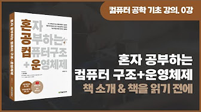

## 혼자 공부하는 컴퓨터구조 + 운영체제

### 유튜브 강의 (하단 이미지 클릭)

### 추가 자료 목록

- [registers](https://github.com/kangtegong/self-learning-cs/blob/main/registers/registers.md#%EB%8C%80%ED%91%9C%EC%A0%81%EC%9D%B8-arm-%EB%A0%88%EC%A7%80%EC%8A%A4%ED%84%B0)
- [system calls](https://kangtegong.github.io/self-learning-cs/system_calls/syscalls.html)		
- process
  - [python으로 프로세스 다루기](https://github.com/kangtegong/self-learning-cs/blob/main/process/process_python.md#python%EC%9C%BC%EB%A1%9C-%ED%94%84%EB%A1%9C%EC%84%B8%EC%8A%A4-%EB%8B%A4%EB%A3%A8%EA%B8%B0)
  - [C/C++로 프로세스 다루기](https://github.com/kangtegong/self-learning-cs/blob/main/process/process_cplusplus.md#cc%EB%A1%9C-%ED%94%84%EB%A1%9C%EC%84%B8%EC%8A%A4-%EB%8B%A4%EB%A3%A8%EA%B8%B0)
- thread
  - [python으로 스레드 다루기](https://github.com/kangtegong/self-learning-cs/blob/main/thread/thread_python.md#python%EC%9C%BC%EB%A1%9C-%EC%8A%A4%EB%A0%88%EB%93%9C-%EB%8B%A4%EB%A3%A8%EA%B8%B0)
  - [C/C++로 스레드 다루기](https://github.com/kangtegong/self-learning-cs/blob/main/thread/thread_cplusplus.md#cc%EB%A1%9C-%EC%8A%A4%EB%A0%88%EB%93%9C-%EB%8B%A4%EB%A3%A8%EA%B8%B0)
- [producer consumer](https://github.com/kangtegong/self-learning-cs/blob/main/producer_consumer/producer_consumer.md)	
- [synchronization](https://github.com/kangtegong/self-learning-cs/blob/main/synchronization/syncronization.md#%EC%BD%94%EB%93%9C%EB%A1%9C-%EB%B3%B4%EB%8A%94-%EB%8F%99%EA%B8%B0%ED%99%94)
- [page table](https://github.com/kangtegong/self-learning-cs/blob/main/page_table/64-ia-32-architectures-software-developer-vol-3a-part-1-manual-p129.pdf) 
  - 자료 출처: [Intel® 64 and IA-32 Architectures Developer's Manual](https://www.intel.co.kr/content/www/kr/ko/architecture-and-technology/64-ia-32-architectures-software-developer-vol-3a-part-1-manual.html)

- [file system](https://github.com/kangtegong/self-learning-cs/blob/main/file_system/file_system.md#%EB%8B%A4%EC%96%91%ED%95%9C-%ED%8C%8C%EC%9D%BC-%EC%8B%9C%EC%8A%A4%ED%85%9C)

### 추가 문의가 있다면?

본 심화 학습 저장소에 보완할 내용이 있거나 

추가 설명이 필요한 내용(예: 추가 자료에서 XX 개념이 어려워요, 영문 자료 해석이 어려워요)이 있다면

[issues](https://github.com/kangtegong/self-learning-cs/issues)에 질문을 남겨주시거나 **tegongkang at gmail dot com** 으로 문의 보내주세요. 

문의에 답해드리거나 추가 자료를 제작해드리겠습니다.

