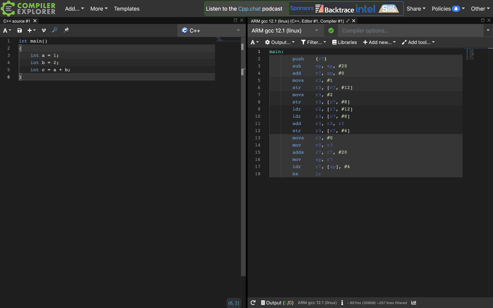
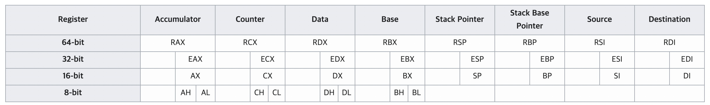
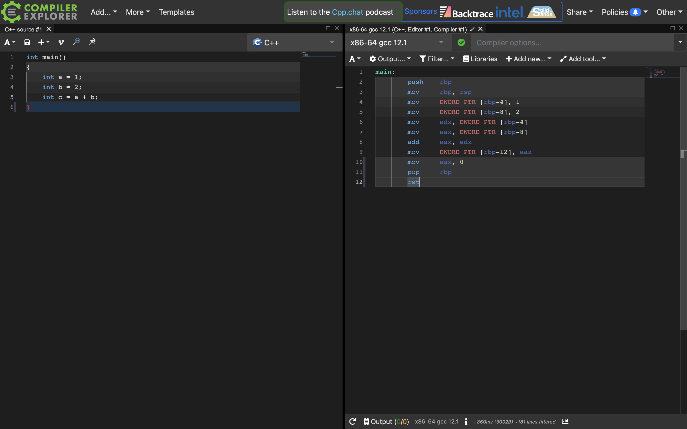

## 대표적인 ARM 레지스터 

ARM CPU는 대표적으로 아래와 같은 레지스터를 제공합니다.

- 13개의 범용 목적 레지스터: `R0` 부터 `R12`
- 스택 포인터: `SP` (`R13`)
- 링크 레지스터: `LR` (`R14`) 함수 호출 등의 서브루틴에서 되돌아갈 주소(리턴 주소)를 저장하기 위해 주로 사용됩니다.
  
- 프로그램 카운터: `PC` (`R15`)
- 프로그램 상태 레지스터(≒플래그 레지스터): `CPSR`

```
링크 레지스터는 범용 레지스터로서 사용될 수도 있습니다. 또한 스택 포인터는 ARM 상태에서 범용 레지스터로 사용될 수 있습니다.

여기서 ARM 상태(ARM state)란 ARM에서는 명령어를 실행할 때 ARM 상태로 실행할 수 있고, Thumb 상태로 실행할 수 있는데, 
전자는 32비트 명령어를 실행하는 모드이고 후자는 16비트 명령어를 실행하는 모드입니다. 

그렇기에 Thumb 상태에서는 ARM 상태로 명령어를 실행할 때에 비해 적은 명령어를 사용합니다. 
Thumb 모드에서는 R0~R7(범용 레지스터 8개), R13(SP), R14(LR), R15(PC) 레지스터를 사용하고, 
ARM mode는 이보다 많은 R0~R12까지 모두 사용할 수 있습니다. 자세한 내용은 이 관련 문서[2]를 확인해보세요.
```

참고로 유의하여야 할 점은, ARM은 실행 모드에 따라 사용되는 레지스터 종류가 달라집니다. ARM 실행 모드에는 크게 User, System, FIQ, Supervisor, Abort, IRQ, Undefined가 있는데, 이 모드 별로 사용되는 레지스터가 달라질 수 있다는 것이지요.

1. `User mode`: 사용자 모드로 실행할 때의 동작 모드

2. `FIQ(Fast Interrupt Request) mode`: 빠르게 처리해야 하는 인터럽트를 처리하기 위한 동작 모드

3. `IRQ(Interrupt Request) mode`: 일반적인 인터럽트를 처리하기 위한 동작 모드

4. `SVC(Supervisor) mode`: 자원에 접근할 수 있는 동작 모드

5. `Abort mode`: 예기치 못한 오류가 발생했을 때의 동작 모드

6. `Undefined`: 정의되지 않은 명령어를 수행하려 할 때의 동작 모드

7. `System mode`: 사용자 모드에서 추가적인 권한을 더 부여한 실행 모드

   

## ARM 명령어

레지스터를 알아본 김에 ARM 명령어도 알아봅시다. 하단 링크(ARM 공식 문서)에서 자세히 확인해볼 수 있습니다. 

https://developer.arm.com/documentation/dui0068/b/ARM-Instruction-Reference


## 프로그램 속 ARM 레지스터

프로그램 속 레지스터를 간편하게 확인해볼 수 있는 웹 사이트를 소개합니다. https://godbolt.org/ 라는 웹 사이트인데, 

이 곳에서 소스 코드에 대한 컴파일러별, CPU별 어셈블리 결과를 볼 수 있습니다.

예를 들어 아래와 같은 소스코드가 있다고 가정해봅시다. 1과 2를 각각 변수에 담고, 이를 더한 값을 또다른 변수에 담는 간단한 코드입니다.

```c
int main()
{
		int a = 1;
		int b = 2;
		int c = a + b;
}
```

이를 ARM CPU에서 gcc 12.1이라는 컴파일러로 실행한 결과는 하단 사진 속 우측 항목과 같습니다.



하나씩 살펴봅시다. 우선 1을 변수 a에 담는 과정입니다. 

참고로 하단 어셈블리어에서 대괄호는 해당 레지스터 값이 저장된 메모리 주소를 의미합니다. (C언어의 포인터를 생각해보세요) ARM의 주소 지정 방식을 표기하는 방법 중 하나이지요.

가령 아래와 같은 명령어가 있을 때, 이는 R0이 가리키고 있는 메모리 주소 값을 R2에 적재하라는 의미입니다.

```
LDR	R2, [R0]	// Load R2 with the word pointed by R0
```

또한 아래와 같은 명령어가 있을 때, 이는 R1이 가리키는 값에서 20 떨어진(변위가 20인) 값을 R0에 적재하라는 의미입니다.

책에서 다룬 변위 주소 지정 방식과 유사하지요?

```
LDR R0, [R1, #20]	R1 + 20    // loads R0 with the word pointed at by R1+20
```

이제 하단의 어셈블리어를 하나씩 살펴보시기 바랍니다.

`int a = 1;`

```
movs    r3, #1					// r3에 1을 저장
str     r3, [r7, #12]		// r3를 r7이 가리키는 곳의 12만큼 떨어진 메모리에 저장
```

> 참고로 godbolt.org 사이트에서 소스 코드 상의 `int a = 1`에 마우스를 갖다 대시면 그에 해당하는 어셈블리어가 하이라이트 됩니다.

`int b = 2;`

```
movs    r3, #2				// r3에 2를 저장
str     r3, [r7, #8]	// r3를 r7가 가리키는 곳의 8만큼 떨어진 곳에 저장
```

`int c = a + b;`

```
ldr     r2, [r7, #12]		// r7가 가리키는 곳의 12만큼 떨어진 곳의 값(1)을 r2에 적재
ldr     r3, [r7, #8]		// r7가 가리키는 곳의 12만큼 떨어진 곳의 값(2)을 r3에 적재
add     r3, r3, r2			// r3과 r2를 더한 값을 r3에 저장
str     r3, [r7, #4]		// r3를 r7가 가리키는 곳에 4만큼 떨어진 곳에 저장
```


## 대표적인 x86(x86-64) 레지스터

기본적으로 x86의 레지스터는 아래와 같은 이름과 용도를 가집니다. 

아래의 이름은 **16비트로 사용될 때**의 이름입니다.

1. AX (Accumulator register): 산술 연산에 사용.
2. CX (Counter register): 시프트/회전 연산과 루프에서 사용.
3. DX (Data register): 산술 연산과 I/O 명령에서 사용.
4. BX (Base register): 데이터의 주소를 가리키는 포인터로 사용. 
5. SP (Stack Pointer register): 스택의 최상단을 가리키는 포인터로 사용.
6. BP (Stack Base Pointer register): 스택의 베이스(최하단)를 가리키는 포인터로 사용.
7. SI (Source Index register): 스트림 명령에서 소스를 가리키는 포인터로 사용.
8. DI (Destination Index register): 스트림 명령에서 도착점을 가리키는 포인터로 사용.

32비트로 사용될 때에는 위의 이름 앞글자에 E를 붙이게 됩니다. 아래와 같이 말이지요.

1. EAX (Accumulator register) 
2. ECX (Counter register) 
3. EDX (Data register) 
4. EBX (Base register)
5. ESP (Stack Pointer register)
6. EBP (Stack Base Pointer register)
7. ESI (Source Index register)
8. EDI (Destination Index register)

또한 64비트에서는 E대신 R을 붙입니다.

1. RAX (Accumulator register)
2. RCX (Counter register)
3. RDX (Data register)
4. RBX (Base register)
5. RSP (Stack Pointer register)
6. RBP (Stack Base Pointer register)
7. RSI (Source Index register)
8. RDI (Destination Index register)

이를 그림으로 정리하면 아래와 같습니다.



> 출처: https://ko.wikibooks.org/wiki/X86_%EC%96%B4%EC%85%88%EB%B8%94%EB%A6%AC/x86_%EC%95%84%ED%82%A4%ED%85%8D%EC%B2%98

다음으로는 세그먼트 레지스터를 알아봅시다. 세그먼트 레지스터라는 말이 조금 어색할 수 있는데, 이는 주소 지정에서 사용되는 레지스터를 의미합니다.

- Stack Segment (SS): 스택을 가리킴.
- Code Segment (CS): 코드를 가리킴.
- Data Segment (DS): 데이터를 가리킴.
- Extra Segment (ES): 추가적인 데이터를 가리킴.
- F Segment (FS): 많은 추가적인 데이터를 가리킴.
- G Segment (GS): 더 많은 추가적인 데이터를 가리킴.

이 밖에도 책에서 다룬 플래그 레지스터에 해당하는 EFLAGS 레지스터, 

프로그램 카운터에 해당하는 명령어 포인터(IP; Instruction Pointer)가 있습니다.


## x86(x86-64) 명령어

레지스터에 대해 알아보았다면 추가로 명령어에 대해서도 학습해보세요. 

하단 링크에서 확인해볼 수 있습니다.

https://en.wikipedia.org/wiki/X86_instruction_listings


## 프로그램 속 x86 레지스터

이제 위에서 언급한 https://godbolt.org/ 라는 웹 사이트에서 소스 코드가 어셈블리어로 변환된 결과를 살펴보겠습니다.

x86에서 (위 예시에서와 동일한) gcc 12.1 컴파일러로 컴파일된 결과입니다.



`int a = 1;`

```assem
mov     DWORD PTR [rbp-4], 1		// rbp에서 4만큼 떨어진 곳에 1을 저장합니다.
```

`int b = 2;`

```
mov     DWORD PTR [rbp-8], 2		// rbp에서 8만큼 떨어진 곳에 2를 저장합니다.
```

`int c = a + b;`

```
mov     edx, DWORD PTR [rbp-4]		// rbp에서 4만큼 떨어진 곳에 저장된 값(1)을 edx에 저장합니다.
mov     eax, DWORD PTR [rbp-8]		// rbp에서 8만큼 떨어진 곳에 저장된 값(2)을 eax에 저장합니다.
add     eax, edx									// eax와 edx 값을 더합니다. (더한 값을 eax에 저장합니다)
mov     DWORD PTR [rbp-12], eax		// eax에 저장한 값을 rbp에서 12만큼 떨어진 곳에 저장합니다.
```


---

참고하면 좋을 자료들

[1] https://developer.arm.com/documentation/dui0473/j/overview-of-the-arm-architecture/arm-registers

[2] https://developer.arm.com/documentation/dui0040/d/CACCIDAH

[3] https://docs.microsoft.com/en-us/windows-hardware/drivers/debugger/x64-architecture#registers

[4] https://ko.wikibooks.org/wiki/X86_%EC%96%B4%EC%85%88%EB%B8%94%EB%A6%AC/x86_%EC%95%84%ED%82%A4%ED%85%8D%EC%B2%98

**『 혼자 공부하는 컴퓨터 구조 & 운영체제』 (강민철, 한빛미디어) 추가 자료** 